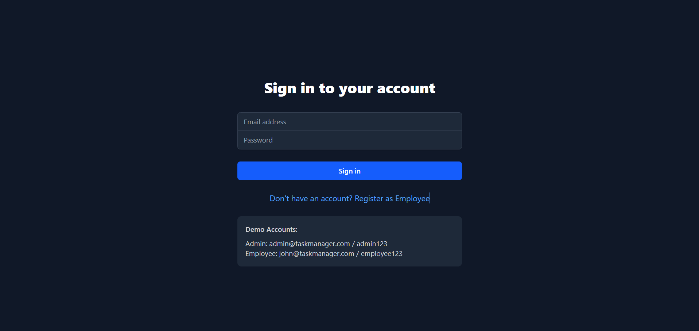
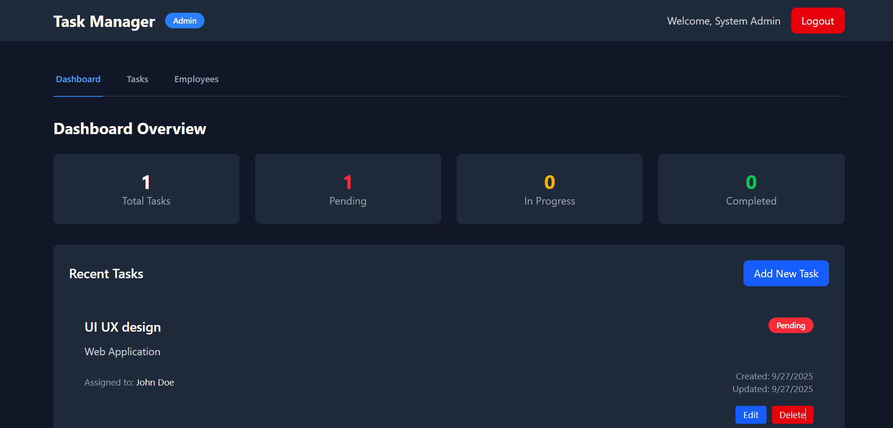
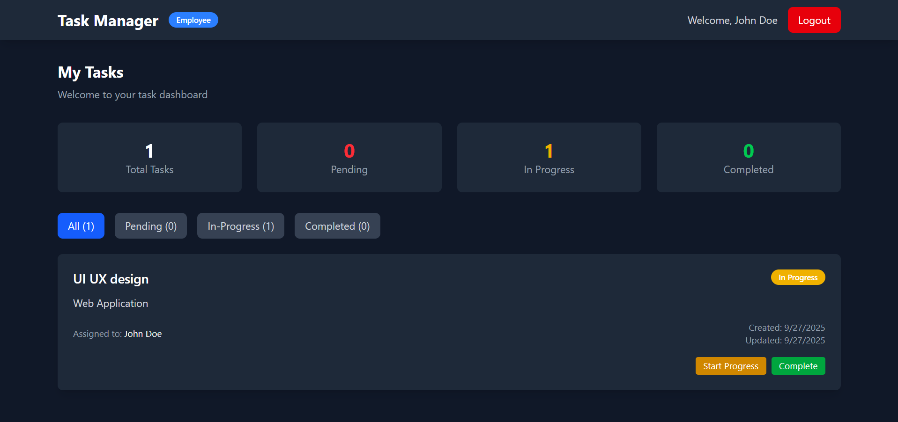
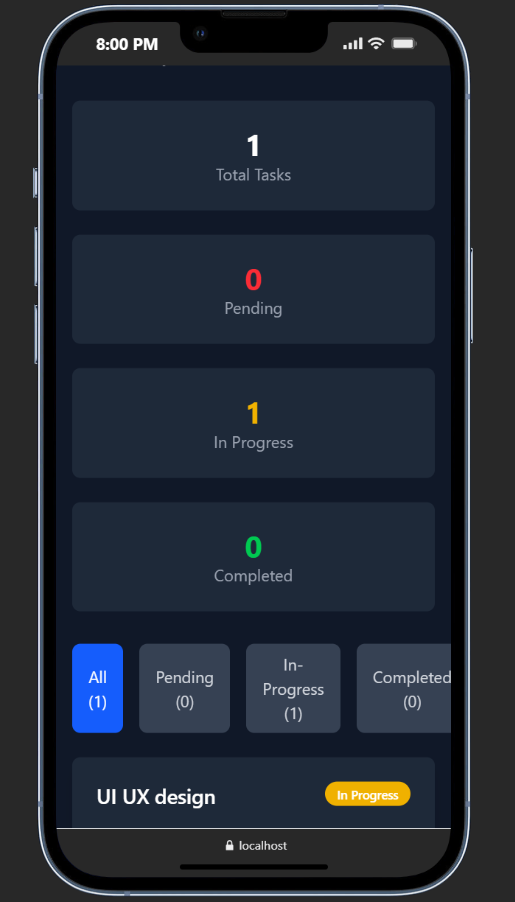

# Employee Management System (EMS)

## 📋 Project Overview
A modern, responsive task management web application built with React and Tailwind CSS. Features role-based access control for administrators and employees with real-time task tracking and management capabilities.

---

## ✨ Key Features

### 👨‍💼 Admin Capabilities
- Employee registration and management
- Task assignment and tracking
- Dashboard with progress statistics
- Full task CRUD operations
- Visual status indicators

### 👨‍💻 Employee Capabilities
- Self-registration and login
- Task status updates (Pending → In Progress → Completed)
- Personal task history
- Responsive task management interface

---

## 🛠 Tech Stack

| Layer            | Technology Used           |
|------------------|---------------------------|
| **Frontend**     | React 18, Tailwind CSS    |
| **Routing**      | React Router DOM          |
| **State Mgmt**   | Context API + Hooks       |
| **Storage**      | Browser localStorage      |
| **Styling**      | Dark-themed responsive UI |

---

## 🔗 Demo Access
- **Live Application**: http://localhost:5173  

**Demo Credentials:**  
- **Admin**: `admin@taskmanager.com / admin123`  
- **Employee**: `john@taskmanager.com / employee123`  

---

## 📱 Application Screenshots

> 🖥️ **Login Page**  

  

---

> 📊 **Admin Dashboard**  

  

---

> 📋 **Employee Dashboard**  

  

---

> 📱 **Mobile Responsive Views**  

  

---

## 🎯 Key UI Elements
- Dark-themed interface with modern design  
- Color-coded task status (Red/Yellow/Green)  
- Responsive cards with hover effects  
- Modal forms for task management  
- Loading spinners and smooth animations  
